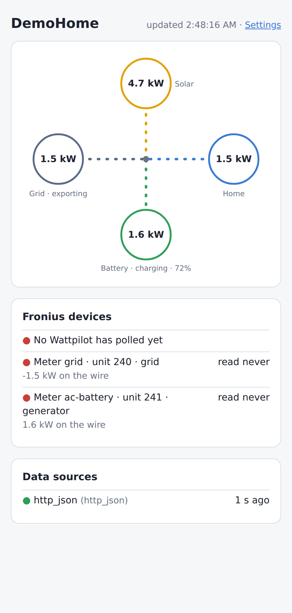

# Solar Bridge

Makes non-Fronius solar, battery and meter hardware look like Fronius devices, so that:

- a **Fronius Wattpilot** can do PV surplus (Eco) charging, with its own app and Eco mode, without a Fronius inverter, and
- a **real Fronius inverter** can read extra **Smart Meter IPs**, e.g. an AC-coupled Tesla Powerwall as an *external generator*, so Solar.web shows the whole house correctly.

It runs on a Raspberry Pi (or any Linux box, or Docker), needs no cloud account, and shows live power flow on a local web page.



> Fronius, Wattpilot and Solar.web are trademarks of Fronius International GmbH. This project is not affiliated with or endorsed by Fronius.

---

## What it emulates

| For | Protocol | Details |
|---|---|---|
| Fronius Wattpilot | Fronius Solar API v1 (HTTP, port 80) + mDNS | A GEN24-style inverter with grid, PV, battery, SOC and per-phase meter data |
| Fronius inverter (SnapIN, GEN24) | Smart Meter IP — SunSpec Modbus TCP (port 502) | Any number of meters on one port, one unit ID each: grid, generator or load position |

## Works with

Pick your device in the settings page — ready-made templates fill in the details:

| Group | Devices |
|---|---|
| Batteries & inverters | **Tesla Powerwall 2 / + / 3** (add-on), **Victron GX** (Cerbo, Venus OS), **Fronius** inverters via Solar API, **SunSpec** inverters over Modbus (SolarEdge, Fronius, Kostal, …) |
| Energy meters | **Shelly** Pro 3EM, 3EM, Pro EM / EM Gen3, **Enphase** IQ Gateway / Envoy |
| Solar | **OpenDTU** (Hoymiles), Shelly plugs (plug-in solar) |
| Anything else | Any **Modbus TCP** device, any **MQTT** topic (Victron, Node-RED, evcc, Home Assistant, …), any **JSON web API** |

Mix and match — e.g. grid power from a Shelly, battery from a Powerwall. Readings split per phase can be added up.
Every device has a **Test** button that shows its live readings before you save.

## Install on a Raspberry Pi

**Hardware:** any Raspberry Pi from the **Pi 2** up, a power supply, a microSD card, and a **network cable** to your router. (Wi-Fi works for reading devices, but the Wattpilot finds the bridge by multicast, which is unreliable over Wi-Fi.)

1. Flash **Raspberry Pi OS Lite** with [Raspberry Pi Imager](https://www.raspberrypi.com/software/) (32-bit for a Pi 2). In its settings, set the hostname — e.g. `fronius-virtual` — a user, and enable SSH.
2. SSH in and run:
   ```sh
   curl -fsSL https://raw.githubusercontent.com/l2smith2/solar-bridge/main/deploy/install.sh | sudo sh
   ```
3. Open **http://fronius-virtual.local/settings** and follow the page: add your devices, check what the readings mean, save.
4. Pair the Wattpilot: Solar.wattpilot app → scan for inverters → pick your display name.

That's it — no files to edit. It starts on boot, restarts itself if anything goes wrong, and keeps energy totals across restarts and power cuts. Run the installer again to update.

### Tesla Powerwall
Tesla support is an add-on, so installs stay small for everyone else. Either:
- choose *Tesla Powerwall* in the settings page and press **Install Tesla Powerwall support**, or
- install it up front: `curl -fsSL …/install.sh | sudo sh -s -- --tesla`

### Hands-off for years (optional)
`sudo raspi-config` → Performance → **Overlay file system** makes the SD card read-only, so power cuts can't corrupt it. Settings changes and energy totals then only last until the next reboot — set everything up first, and leave it off if Solar.web energy history matters to you.

## Docker

```sh
docker build -t solar-bridge .                      # add Tesla: --build-arg EXTRAS=app,tesla
docker run -d --name solar-bridge --network host --restart unless-stopped \
  -v solar-bridge:/var/lib/solar-bridge solar-bridge
```
Then open `http://<host>/settings`. `--network host` is required for mDNS.

---

## Settings

Everything is set in the web page at `/settings`:

1. **Devices** — where readings come from. Pick a template, enter the address, press **Test**.
2. **What the readings mean** — choose the reading for grid, solar, battery, battery charge and home. Each shows a live description (“exporting to the grid 1.3 kW”, “battery charging 1.6 kW”); tick **Invert** if one is backwards. Home consumption is worked out automatically if you leave it out.
3. **Wattpilot & Fronius** — display name, grid phases, main breaker rating, and optional Smart Meter IPs.
4. **Settings password** — optional; without one, anyone on your network can change the settings.

Settings are kept in `/var/lib/solar-bridge/config.json`.

### Prefer a file? (optional)
Create `/etc/solar-bridge/config.yaml` from [`deploy/config.example.yaml`](deploy/config.example.yaml) (install with `--yaml`), or run `solar-bridge --config my-settings.json`. The web page then shows the settings read-only. `solar-bridge --check` reads every device once and prints what would be served.

### Adding a Smart Meter IP on the Fronius inverter
Add the meter under **Settings → Wattpilot & Fronius → Smart Meter IPs**, choosing what it measures and its position. Then, in the Fronius inverter's web interface, add a **Fronius Smart Meter IP** at the bridge's IP address, with the meter's **unit ID** as the Modbus address and the same position (feed-in point / external generator / consumption path). All meters share port 502.

**Example — an AC-coupled battery as an external generator:** add a meter measuring *Battery power* with position *External generator* (unit 241 by default, next to the grid meter on 240).

A meter reports power flowing *from the grid side into the device* as positive, like a real meter wired with the grid on one side: a discharging battery at the generator position reads negative, which Fronius shows as generation. If yours shows backwards, tick the meter's **Invert**.

---

## Web page

`http://<name>.local/` shows live solar, grid, battery and home power, plus:
- when the Wattpilot last polled, and when the Fronius inverter last read each meter
- each device's health and any problems (e.g. a port that couldn't be opened)

`/api/state` returns the same as JSON.

## Home Assistant

Prefer Home Assistant? The [Fronius Virtual Inverter](https://github.com/l2smith2/fronius-virtual-inverter) integration does the same inside HA, using HA sensors as sources.

## Development

```sh
pip install -e ".[app,test]"
pytest
solar-bridge --data-dir ./data --port 8080     # then open http://localhost:8080/settings
```

Optional extras: `tesla` (pypowerwall), `yaml` (YAML settings files), `all`.

`solar_bridge.core` (the protocol emulation) depends only on aiohttp, so the Home Assistant integration can use it as a library. Everything else lives in `solar_bridge.app`.

## License

MIT
